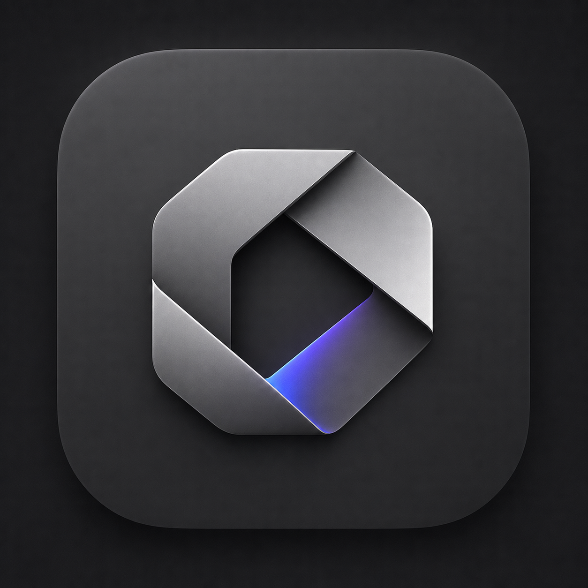

<div align="center">



# Clip4X

**Local-first macOS app that turns long videos into clean, captioned short clips.**

Drop a video → Whisper transcribes → Codex ranks the strongest moments → FFmpeg exports
vertical `9:16` or square `1:1` clips with blurred-fill backgrounds and burned-in captions.

Runs entirely on your machine. No uploads, no cloud, no accounts.

</div>

---

## Features

- **Drag-and-drop** any FFmpeg-readable video (MP4, MOV, …).
- **Local transcription** with [`openai-whisper`](https://github.com/openai/whisper) — timestamped segments.
- **Moment ranking** via the Codex CLI to surface cohesive, viral-friendly clips.
- **One-click export** to `9:16` (vertical) or `1:1` (square).
- **Blurred-fill background** with the source centered, plus sticky hook + caption overlays.
- **Dark mode UI** built in SwiftUI.
- Exports land in `~/Desktop/Clip4X Exports` by default (configurable in-app).

## Requirements

macOS 14 (Sonoma) or later, plus these tools on your `PATH`:

```sh
brew install ffmpeg openai-whisper
```

| Tool       | Used for                                              |
|------------|-------------------------------------------------------|
| `ffmpeg`   | Rendering clips (blurred fill, overlays, captions)    |
| `ffprobe`  | Reading source media metadata                         |
| `whisper`  | Local timestamped transcription                       |
| `codex`    | Ranking transcript segments into clip candidates      |

## Run from source

```sh
swift run Clip4X
```

## Build a signed app + DMG

The packaging script builds a release binary, assembles `Clip4X.app`, code-signs it with a
Developer ID identity and hardened runtime, builds a DMG, notarizes it, and staples the ticket.

```sh
./Scripts/package-app.sh
```

Outputs:

- `Build/Clip4X.app` — signed application bundle
- `Build/Clip4X-0.1.0.dmg` — signed + notarized disk image

Override defaults with env vars:

| Var              | Default                                                   |
|------------------|-----------------------------------------------------------|
| `DEV_ID`         | `Developer ID Application: Rachel Larralde (5U92RP4C5J)`   |
| `NOTARY_PROFILE` | `AC_NOTARY` (a stored `xcrun notarytool` keychain profile) |
| `SKIP_NOTARIZE`  | set to `1` to sign only                                   |

First-time notary setup (once per machine):

```sh
xcrun notarytool store-credentials notarize \
  --apple-id "you@example.com" \
  --team-id 5U92RP4C5J \
  --password "app-specific-password"
```

## Project layout

```
Sources/
  Clip4X/          SwiftUI app (UI, AppModel)
  Clip4XCore/      Pipeline: transcription, ranking, FFmpeg, captions
Scripts/
  package-app.sh   Build + sign + notarize + DMG
Assets/AppIcon/    App icon (.icns + iconset)
```

## License

Private. © Rachel Larralde.
